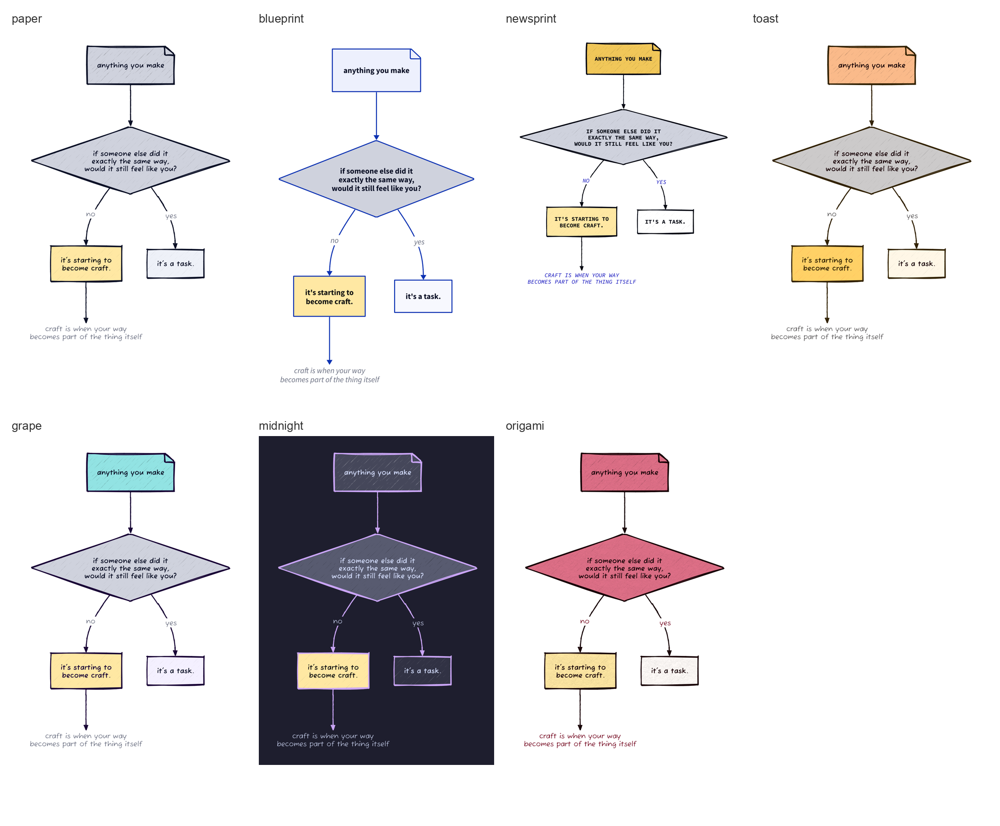

# inkpost

Turn a blog post into hand-drawn diagrams.

You give inkpost a markdown post. A language model reads it. The model picks 2 to 4
visual patterns that match the moves the essay makes. It fills each pattern with
sentences taken word for word from your own writing. [d2](https://d2lang.com) draws
the result in hand-drawn sketch mode.

Nothing goes to a server you do not control. No account. No upload. No telemetry.



---

## Start here

Three commands. Two minutes.

```bash
git clone https://github.com/howwohmm/inkpost
cd inkpost
pip install ".[pretty]"
```

Now check your machine:

```bash
inkpost --doctor
```

The check tells you what is missing and how to fix each item. If something is
missing, run the guided setup:

```bash
inkpost --setup
```

Then make your first diagrams. Two example posts ship with the repo.

```bash
inkpost posts/2026-01-15-the-tuesday-problem.md
```

The images land in `runs/the-tuesday-problem/`.

### What you need

| Item | Required | How to get it |
|---|---|---|
| Python 3.9 or newer | yes | already on most machines |
| `d2` v0.9.0 or newer | yes | `brew install d2` |
| A model | yes | see the next section |

`d2` draws every diagram, so inkpost cannot run without it. The installer also works:

```bash
curl -fsSL https://d2lang.com/install.sh | sh -s --
```

### Pick a model

inkpost needs one of these. It picks the best one it finds.

| Backend | Cost | Speed | Word quality |
|---|---|---|---|
| `claude-code` | your Claude plan | about 2 minutes | best |
| `openrouter` | free | 12 to 25 seconds | good |
| `mock` | free | instant | none, for tests only |

**The free route.** Make a key at [openrouter.ai/keys](https://openrouter.ai/keys).
Put it in `.env` at the repo root:

```
OPENROUTER_API_KEY=sk-or-...
```

The default models all end in `:free`. They cost nothing. `inkpost --setup` writes
this file for you.

**The better route.** Install the [Claude Code CLI](https://claude.com/claude-code).
inkpost then uses it with no key and no extra cost beyond your plan. The labels come
out noticeably better. A free model writes `internal conflict`. Claude writes
`if i'm not productive every minute, i'm falling behind`.

---

## Use it

### The command line

Run it with no arguments to pick a post from a list:

```bash
inkpost
```

Or name a post. A file path or a slug both work.

```bash
inkpost my-post.md
inkpost the-tuesday-problem
```

Pick the look with `-m`. You can pass several modes or `all`.

```bash
inkpost my-post.md -m paper,midnight
inkpost my-post.md -m all
```

Every flag:

| Flag | Meaning |
|---|---|
| `-m`, `--modes` | one or more modes, or `all`. Default is `paper` |
| `-f`, `--formats` | `png`, `svg`, `gif`. Default is `png,svg` |
| `-b`, `--backend` | `auto`, `claude-code`, `openrouter`, `mock` |
| `--model` | name a different model |
| `--posts-dir` | the folder to pick posts from |
| `--list` | show posts, modes and backends |
| `--runs` | show what you made before |
| `--open SLUG` | open an old run again |
| `--doctor` | check d2, models and posts |
| `--setup` | guided first-time setup |
| `--no-open` | do not open a file browser at the end |

From a clone without an install, use `./bin/inkpost` instead of `inkpost`.

### The web interface

```bash
inkpost-serve
```

Open `http://localhost:8788`. Paste a post or pick one. Choose the modes. Press run.
The gallery puts one diagram per row and one mode per column, so you can compare the
same idea across looks. Click any image to get a large view, edit the diagram source
by hand, and download the file.

From a clone, use `./bin/inkpost-serve` or `python3 server.py`.

---

## How it works

1. inkpost removes the frontmatter and the newsletter footers from your post.
2. The model reads the post and picks 2 to 4 patterns that fit its moves.
3. The model fills each pattern with your own sentences.
4. `d2 validate` checks every diagram. A broken one goes back to the model once.
5. `d2` draws each diagram in each mode you chose.

Each run writes a folder under `runs/<slug>/`:

```
runs/my-post/
  post.md           the post you gave it
  plan.json         what the model chose, and why
  src/*.d2          the diagram source, yours to edit
  out/paper/*.png   the images, one folder per mode
```

The diagram source is plain text. Edit a label, run `d2` on the file, and you get a
new image. The model gives you a first draft, not a locked result.

---

## The eleven patterns

Each pattern draws one kind of move an essay makes.

| Pattern | The move it draws |
|---|---|
| `collage` | many inputs, one self |
| `collapse` | many options, one path |
| `comic` | a diary sequence |
| `committee` | a dialogue with yourself |
| `contrast` | a messy thing against a clean thing |
| `layers` | an outer thing that hides an inner thing |
| `loop-exit` | a cycle, and the one exit from it |
| `poster` | one line that carries a whole post |
| `steps` | one idea at a time, as a GIF |
| `taxonomy` | kinds of a thing, ranked |
| `test` | a yes or no that sorts the world |

`docs/PATTERNS.md` shows each pattern with its labels and its source.

## The seven modes

| Mode | Look |
|---|---|
| `paper` | grey ink and one yellow accent. The default |
| `blueprint` | clean lines, no hand-drawn wobble |
| `newsprint` | black and white, monospace, in capitals |
| `toast` | warm and tinted |
| `grape` | aubergine. Good for a poster |
| `midnight` | dark background |
| `origami` | a soft paper-fold palette |

`docs/MODES.md` gives the exact theme and color for each one.

---

## Advanced use

### Point it at your own posts

```bash
export INKPOST_POSTS_DIR=~/blog/content/posts
```

Or set `posts_dir` in `~/.config/inkpost/config.json`. Or pass `--posts-dir` on any
command.

### Match your writing voice

The prompts describe the author in general terms by default. You can make them match
how you write:

```bash
export INKPOST_AUTHOR="your name"
export INKPOST_VOICE_STYLE="short technical prose about systems"
export INKPOST_VOICE_LOWERCASE=1
```

The same keys work in `~/.config/inkpost/config.json`. A named preset also works:

```bash
export INKPOST_VOICE=lowercase-diary
```

### Add a pattern

Write a `.d2` file in `patterns/`. Add an entry to `PATTERNS` in `patterns.py` with
the same source. inkpost reads the labels out of the file, so you never write a list
of slots by hand. `CONTRIBUTING.md` has the detail.

### Environment variables

| Variable | Meaning |
|---|---|
| `OPENROUTER_API_KEY` | the key for free models |
| `INKPOST_POSTS_DIR` | where your posts live |
| `INKPOST_BACKEND` | force a backend |
| `INKPOST_AUTHOR` | the author name in the prompts |
| `INKPOST_VOICE_STYLE` | one sentence about your register |
| `INKPOST_VOICE_LOWERCASE` | keep every label lowercase |
| `INKPOST_D2` | a different `d2` binary |
| `INKPOST_HOME` | where an installed copy writes runs |

---

## When it does not work

**`d2 not found`.** Install it with `brew install d2`. Then run `inkpost --doctor`.

**`tala layout missing`.** Your `d2` is too old. Most patterns need the TALA layout
engine, which ships inside d2 from v0.9.0.

**No model.** Run `inkpost --setup`. It walks you through the free option.

**The free models return 429.** They share a pool with everyone else, so they run out
at busy times. inkpost tries four models in order. If all four fail, wait a minute or
use `-b claude-code`.

**`claude -p` is slow.** Two minutes is normal for a long post. Use `-b openrouter`
when you want speed.

**A diagram is missing.** inkpost drops a diagram when the model leaves labels empty.
An empty label shows a placeholder such as `step one`, which looks worse than no
diagram. Run it again, or use a stronger backend.

**A GIF fails on some modes.** The `steps` GIF fails on `toast`, `midnight` and
`origami` with a d2 raster error. It works on `paper`, `blueprint`, `newsprint` and
`grape`.

**The server does not restart.** On macOS, `pkill -f "python3 server.py"` matches
nothing. Use `pkill -f server.py`.

---

## Credits

[d2 and the TALA layout engine](https://d2lang.com) by Terrastruct, under MPL-2.0.
TALA draws the whiteboard-style layouts. [clypi](https://github.com/danimelchor/clypi)
styles the command line.

MIT licensed. See `LICENSE`.
